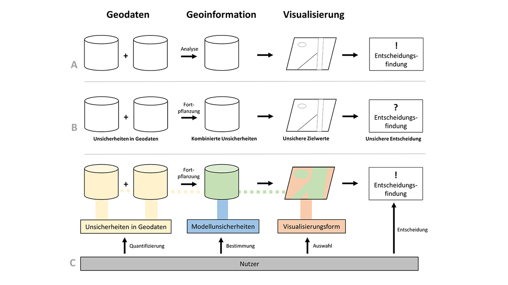
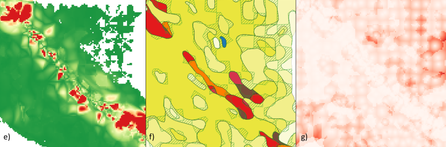

_For the english GUI of the BEMUDA tool, please execute [bemuda_en.py](https://gitlab.com/g2lab/bemuda/blob/master/bemuda_en.py). The english version of the readme will follow soon..._

# BEMUDA - Besser entscheiden mit unsicheren Daten
Entwicklung eines Tools zur Behandlung von Unsicherheitsinformationen und deren
Auswirkungen in raumzeitlichen Datenanalysen als unterstützendes Instrument in
Entscheidungsprozessen

Implementierung einer Methode, die die Behandlung von Unsicherheiten über den
gesamten Bearbeitungsprozess geographischer Datenbestände auch für fachfremde
Experten und GIS-Laien ermöglicht (siehe Abb. C). Sie umfasst die Beschreibung von 
Unsicherheiten in den Ausgangsdaten, die Entwicklung von Methoden zur 
Betrachtung der Fortpflanzung der Unsicherheit sowie die Ableitung von 
aufgaben- und nutzerorientierten Visualisierungen zur entscheidungsrelevanten 
Kommunikation der Auswirkungen.

## Analysen
Da es aufgrund der Vielzahl an Unsicherheitstypen keine allgemeingültige Unsicherheitsbeschreibung geben kann, muss die Unsicherheitsmodellierung auf die jeweilige Anwendung angepasst werden. Die folgenden Analysen wurden im Projekt BEMUDA prototypisch umgesetzt:
* Isochronenanalysen
* Vergleich von Interpolationsmethoden
* Rasterrechner

Weitere Analysewerkzeuge können in Zukunft ergänzt werden. Im Folgenden sollen die einzelnen Analysen kurz beschrieben werden.

### Isochronenanalyse
Isochronenanalysen werden i.d.R. verwendet, um zu bestimmen, welche Bereiche mit einem vorgegebenen Verkehrsmittel in einer bestimmten Zeit erreichen werden können. Durch die zusätzliche Unsicherheitsinformation in den Karten lassen sich die berechneten
Isochronengrenzen besser interpretieren: Während in gängigen Isochronen-Tools ein klarer
Grenzverlauf visualisiert wird , kann mit Hilfe der visualisierten Unsicherheit abgeschätzt werden, wie
dieser Grenzverlauf im Vergleich zum Gesamtanteil der Strecke zu bewerten ist.

Als Eingabe wird ein graphml-Datensatz benötigt. Ein entsprechendes Netzwerk kann mit dem Skript [download.py](https://gitlab.com/g2lab/bemuda/blob/master/data/download.py) von OpenStreetMap heruntergeladen werden. Die weiteren Eingaben (Reisemodus, Reisezeit, Startpunkt) entsprechen denen herkömmlicher Isochronentools. Das BEMUDA-Tool ermöglicht zudem die Beschreibung von Unsicherheitsinformationen in den Eingangsdaten sowie in der Modellierung. Als Ergebnis lassen sich vier Karten erstellen: Visualisierungen auf Basis von Netzwerkknoten (a) und -kanten (b), abgeleitete alpha-Shapes (c) sowie eine Karte, die den größten Unsicherheitsfaktor pro Strecke ausgibt (d).

### Vergleich von Interpolationsmethoden
Die Auswahl der geeigneten Interpolationsmethode hat einen Einfluss auf das Ergebnis der Interpolation und damit auch auf eine potentielle Entscheidung, die auf Basis dieser Analyse getroffen wird. Das BEMUDA-Tool stellt zwei Analysen von Interpolationsverfahren zur Verfügung. Zum einen kann die maximale Differenz ermittelt werden, in der sich Interpolationsverfahren für einen ausgewählten Datensatz unterscheiden. Zum anderen können Flächen eines Polygonlayers identifiziert werden, die von der Nearest-Neighbor-Interpolation abweichen.  

Für die Analysen werden zwei Datensätze benötigt: Ein Punktlayer, auf dessen Basis die Interpolationen erfolgen sollen und ein Flächenlayer, der als Referenz für die Größe des Rasters und für den Vergleich mit den Voronoi-Polygonen herangezogen wird. Als Ergebnis lassen sich Regionen mit einer hohen Unsicherheit durch die Auswahl des Interpolationsverfahrens (e; in rot), sowie solche Regionen, die nicht der Kategorie des nächsten Nachbars zugeordnet sind (f; grün gestreift), identifizieren. Die Ergebnisse werden im TIFF- bzw. Shape-Format gespeichert, die Farbgebung wurde im Nachhinein mit QGIS hinzugefügt.

### Rasterrechner
Zudem wurde ein abstrakter Rasterrechner der Unsicherheit implementiert. Die Unsicherheit eines jeden Pixels errechnet sich dabei aus der Distanz zum nächsten Messpunkt und der Variation der Kategorien der benachbarten Messpunkte. Die Unsicherheit einer Rasterzelle ist demnach kleiner, wenn viele Datenpunkt in der Nähe sind, die alle der selben Kategorie zugeordnet werden können, und größer, wenn die nächsten Datenpunkte weiter entfernt sind und unterschiedlichen Kategorien angehören.

Für die Analysen werden ebenfalls zwei Datensätze benötigt: Ein Punktlayer mit den kategorisierten Messpunkten und ein Flächenlayer, der als Referenz für die Größe des Rasters herangezogen wird. Das Ergebnis des Rasterrechners (g) im TIFF-Format wurde ebenfalls im Nachhinein bearbeitet.

## Getting started

### Mit pip
`pip install -r requirements.txt`

### Manuell
Benötigte Python-Packages:  

descartes==1.1.0  
Fiona==1.8.13  
geovoronoi==0.2.0  
matplotlib==3.3.0  
MetPy==0.12.1  
networkx==2.4  
numpy==1.18.5  
osmnx==0.15.1  
pyproj==2.6.1.post1  
PyQt5==5.15.0  
scipy==1.4.1  
Shapely==1.7.0  
uncertainties==3.1.4  

Zum starten [bemuda.py](https://gitlab.com/g2lab/bemuda/blob/master/bemuda.py) ausführen.

## Datengrundlagen:
Für die Berechnung der Isochronen wird auf einen Datensatz zur Unterscheidung von städtischen und ländlichen Regionen von Eurostat zurückgegriffen:  
[https://ec.europa.eu/eurostat/de/web/rural-development/methodology](https://ec.europa.eu/eurostat/de/web/rural-development/methodology)

Die Geometrien entstammen dem NUTS-Datensatz:  
[https://ec.europa.eu/eurostat/de/web/gisco/geodata/reference-data/administrative-units-statistical-units/nuts](https://ec.europa.eu/eurostat/de/web/gisco/geodata/reference-data/administrative-units-statistical-units/nuts)  

&copy; EuroGeographics bezüglich der Verwaltungsgrenzen

## Publikation
Knura, M. & Schiewe, J. (2020):	Behandlung von Unsicherheitsinformationen in raumzeitlichen Datenanalysen für die Entscheidungsfindung. GIS.Science, 3: 85-94.

## Danksagung
Das Tool ist im Rahmen des vom Bundesministerium für Verkehr und digitale Infrastruktur (BMVI) unter dem Kennzeichen 19F1050A geförderten Projektes „BEMUDA – Besser entscheiden mit unsicheren Daten“ entstanden.
